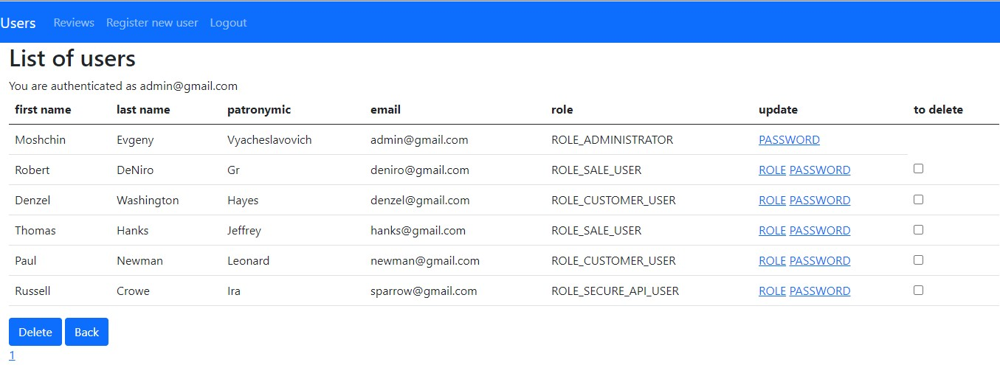
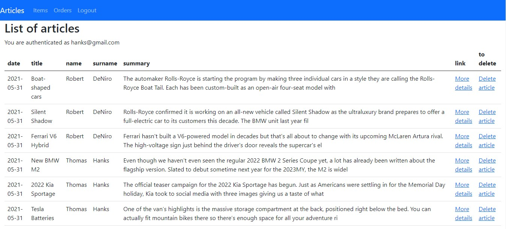
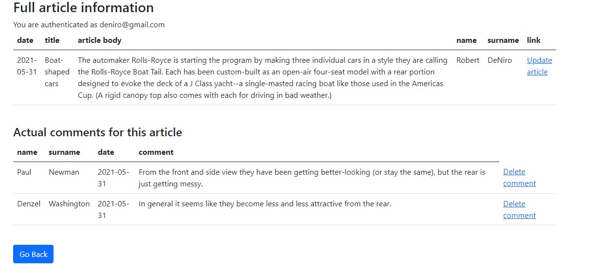
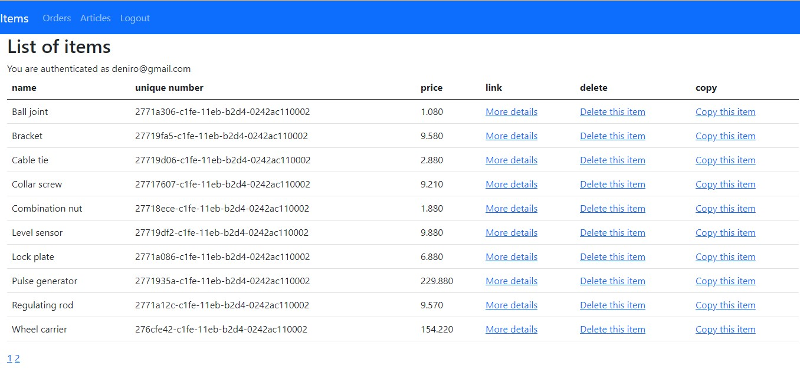
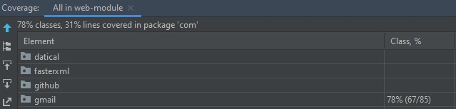
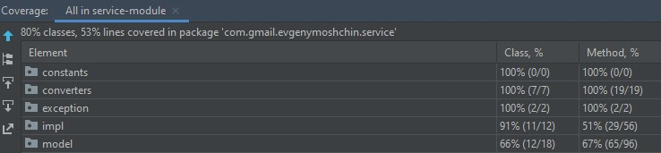

# java_application
> This is final course project. My java application is an online resource that includes a simple online store and a news section. The project uses 4 roles for users who have different access and capabilities
> Live demo [_here_](https://www.example.com). <!-- If you have the project hosted somewhere, include the link here. -->

## Table of Contents
* [General Info](#general-information)
* [Technologies Used](#technologies-used)
* [Features](#features)
* [Screenshots](#screenshots)
* [Setup](#setup)
* [Project Status](#project-status)
* [Room for Improvement](#room-for-improvement)
* [Acknowledgements](#acknowledgements)
* [Contact](#contact)

## General Information
##### This application can be used for the following purposes:
- For selling various goods Online
- To form and track user orders
- To create and show actual news and events
- Every customer can leave his feedback to improve application

##### About users access:
- ADMINISTRATOR can register new users, delete users, change their roles and generate new passwords. The admin can also control the visibility of user reviews and, if necessary, remove them.
- SALE user can write articles, modify them, delete user comments. The seller can also delete goods from the database or copy existing ones. The seller keeps track of the customer orders, changes the status of orders. Has information about the customer to contact him.
- CUSTOMER can see a list of all articles, read any articles in detail. Also, customers can go to the section of items, get detailed information on each item and order anyone, set the quantity. Every customer has his profile, where he can change personal information and generate a new password, which he will receive by email. Customers can leave feedback on the application and also see reviews from other customers.
- SECURE API user created to work with REST API. REST user can add new users, add products, get information about orders, articles, etc.

## Technologies Used
- Java - version 11.0
- Maven
- Git
- Devtools
- Docker
- Spring Boot - version 2.4.2
- Spring Security
- Spring MVC
- REST
- JSON
- HTML5
- Thymeleaf
- Lombok
- Log4j2
- Hibernate
- MySQL
- Liquibase 
- JUnit5 with Mockito

## Features
This project created according to the following tasks:
- feature/project1 [Task1 ](https://docs.google.com/document/d/1lq_VUaq25dyv48peo-qylTBEtX7pg7nj7N8F9j8WGyc/edit?usp=sharing)
- feature/project2 [Task2 ](https://docs.google.com/document/d/1UfPH1vD-qGoeiT7BWMeNwDxfzDCSiQ79nePdi2CjJbU/edit?usp=sharing)
- feature/project3 [Task3 ](https://docs.google.com/document/d/1eYGz6PgzAHsIxpTHEobMFKJnRn9GgSpoZjZUCxj1uhI/edit?usp=sharing)
- feature/project4 [Task4 ](https://docs.google.com/document/d/1yvMec9KnQPg0d3kN-L7257d7p7LVrIKUPi3rmY_bSR4/edit?usp=sharing)

## Screenshots

## Setup
#####Steps:
- On the command line:
git clone https://github.com/evgenymoshchin/java_application.git
- Inside IntelliJ IDEA In the main menu, choose File -> Open and select the java_application pom.xml. Click on the Open button.
- You could start MySQL locally with Docker:
- docker run -e MYSQL_USER=root -e MYSQL_PASSWORD=1234 -e MYSQL_DATABASE=java_application_database -p 3306:3306 mysql:8
- Run the application by right clicking on the Application main class and choosing Run 'Application'.
- Navigate to Application

  Visit http://localhost:8080/login in your browser.

## Project Status
Project is: _complete_

## Room for Improvement

Room for improvement:
- to add UUID number instead of user-id, to improve the security of the application
- to add categories of items
- to add special order numbers which match items categories, to make an application more informative 
- to add the ability to leave comments for customers on the articles

## Acknowledgements
- This project was based on tasks from course Java EE IT Academy Minsk.
- Many thanks to best JAVA EE trainer [Artsiom Peravoznikau](https://www.linkedin.com/in/artsiom-peravoznikau/), who gives me knowledge to make this project. 

## Contact
Created by evgeny.moshchin@gmail.com - feel free to contact me!
